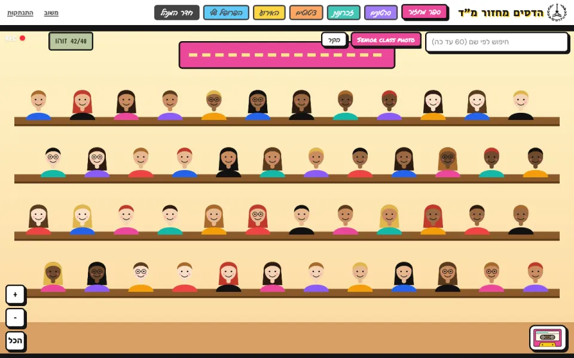
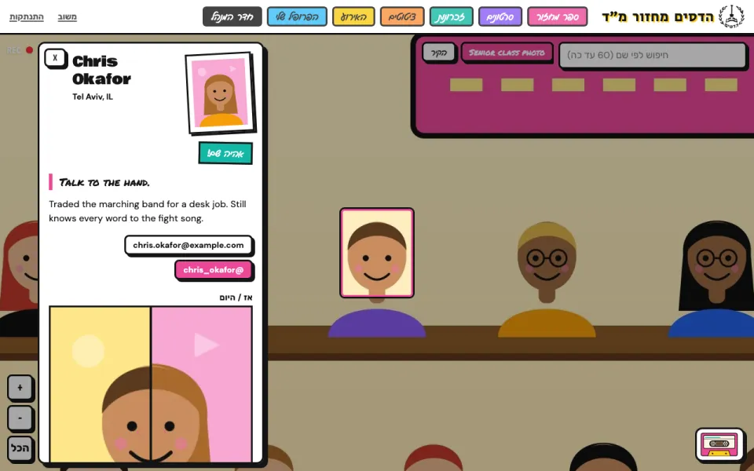
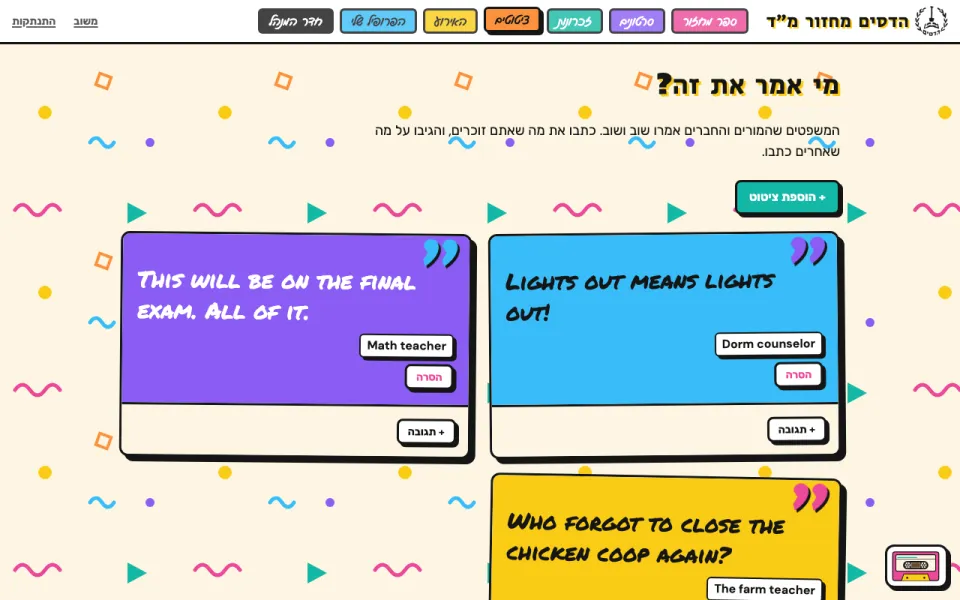
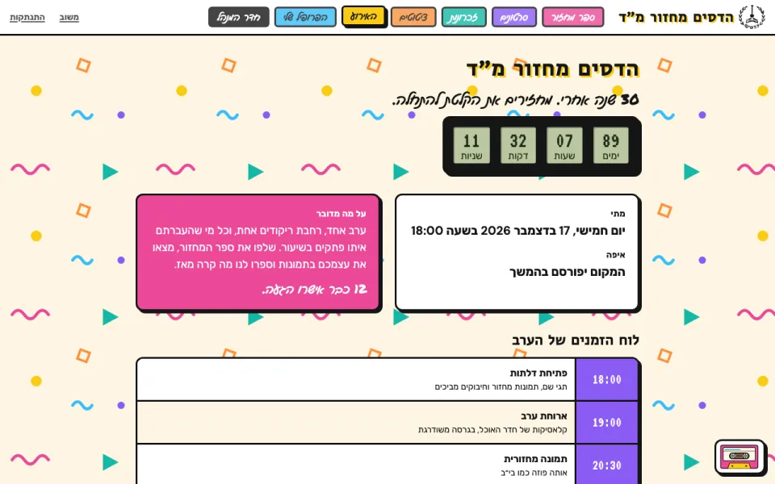
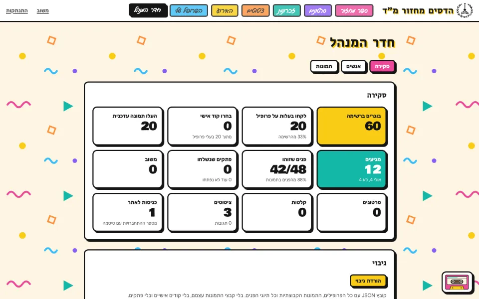
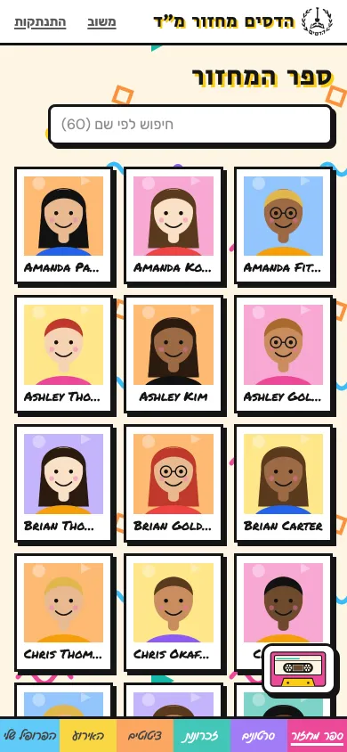

# Reunion Web

A private website for the Hadassim class of '96 reunion. The site is fully working and runs on Railway. The interface is in Hebrew and laid out right-to-left.

The centerpiece is a zoomable "yearbook": the class composite posters from 1990, 1993 and 1996 as deep-zoom pictures with a clickable box on every face. Classmates find themselves, put a name on a face ("That's me!" or "I know who this is"), claim their profile and fill in what they have been up to. Around it: a 90s cassette-deck mixtape that classmates fill with songs, a video library, a quotes wall, private notes between classmates, the shared photo album, and the event page with an RSVP count.

## Screenshots

Taken with the built-in demo data (generated cartoon classmates, not real people). Real class photos are never committed.

<table>
  <tr>
    <td width="50%"><br><sub>Yearbook: deep-zoom class photo, a box on every face</sub></td>
    <td width="50%"><br><sub>Profile panel with contact links and a then/now slider</sub></td>
  </tr>
  <tr>
    <td><br><sub>Quotes wall ("Who said it?")</sub></td>
    <td><br><sub>Event page: countdown, details, RSVP count, schedule</sub></td>
  </tr>
  <tr>
    <td><br><sub>Principal's Office (admin) overview</sub></td>
    <td align="center"><br><sub>On phones: a portrait grid instead of the big photo</sub></td>
  </tr>
</table>

## Features

- **Passcode gate.** One shared class passcode, checked on the server and rate limited. Nothing (API, pictures, uploads) is served without it, except the old school postcard on the passcode screen. A separate admin passcode unlocks the organizer tools. Every response is `noindex`.
- **Yearbook viewer.** OpenSeadragon deep zoom, one tab per picture plus a generated portrait wall of everyone, search that flies to a person, a deep link per person (`/p/:id`), a "through the years" strip cropped from each poster, and a then/now slider. Phones get a grid of portrait tiles instead, so nobody downloads the big posters on mobile data.
- **Find friends.** Search by name and slice the yearbook by the year of the class photo, by class, and by boys or girls, sorted by name or grouped by class. The filters live in the address, so a slice can be shared. It is the phone yearbook, and on bigger screens it sits next to the class photos at `/friends`.
- **Welcome.** Once the site knows who you are, it says hello (good morning, good evening), shows where your RSVP stands and how many days are left. Once per visit.
- **Crowd-sourced names.** Unnamed faces can be named by any classmate, either as an existing person or as a new, unclaimed profile. A profile owner can take their name off a wrongly tagged face ("That's not me"); organizers can do the same for anyone.
- **Profiles.** Claim your face or add yourself if you are not on the roster. Fill in a nickname, city, bio, a favorite quote, contact links (email, phone, Instagram, LinkedIn, Facebook, X, website), then and now photos, and whether you are coming. "Remove my info" wipes everything except the name and releases the profile.
- **Signing in.** Claiming returns a private edit link; only its hash is stored. A personal code (salted scrypt) signs you in on another phone or computer, and each device gets its own key. Forgot the code? A one-time sign-in link is emailed to the address on the profile (valid for 30 minutes). Wrong codes are rate limited per device and per profile.
- **Notes.** Pass a private note to one classmate, signed or anonymous. Anonymous notes store no sender at all, so nobody (admins included) can tell who wrote them. Only the recipient can read or delete a note, and unread notes show as a badge on the profile button.
- **Mixtape.** A persistent player dressed as a cassette deck. Any classmate can add a tape: YouTube or YouTube Music videos and playlists, or Spotify tracks, albums, playlists and `spotify:` links. Titles are fetched automatically. It keeps playing across pages, moves to the next tape when one ends, and pauses when a video starts.
- **Videos.** Classmates paste YouTube, Instagram, Facebook or X links; each plays in place on click. Organizers' picks from the event details come first.
- **Quotes wall ("Who said it?").** Things teachers and classmates used to say. Anyone can add a quote (who said it and when are optional) and comment on any quote.
- **Memories.** Photos from the shared Google Photos album, shown as a grid with a full-screen viewer. Google has no API for shared albums, so the server reads the album page itself (cached for 30 minutes) and falls back to a plain link if that stops working.
- **Event.** Countdown, RSVP buttons, time and place, schedule and how many people have said they are coming, all from the event details (see Configuration). Until you answer, a yellow RSVP button sits in the header (in the middle of the bottom bar on phones); after that it turns into a countdown.
- **Feedback button.** Messages to the organizers are saved first, then emailed when email is set up.
- **Admin ("Principal's Office").**
  - Overview: roster size, claimed profiles, RSVPs, faces named, notes sent (counts only), tapes, videos, quotes, visits.
  - Pictures: upload (auto-tiled), auto-detect faces in the browser (MediaPipe), draw, move and delete boxes (Annotorious), assign names, rebuild the portrait wall.
  - People: add and edit, CSV roster import, reset a claim, mark a profile in memoriam.
  - Class roster: the names printed under the faces (an initial and a surname) become unclaimed profiles, matched across the posters. A one-by-one review fixes a name and marks boy or girl with one tap or key; other views merge possible duplicates, name the faces that could not be read, and hide staff. Staff faces stay in the database but never reach the yearbook, the search or the counts. The reviewed roster downloads as one JSON file and uploads on another copy of the site, where faces are matched by picture and position and names people already gave are kept.
  - Moderation: remove any tape, video, quote or comment, and read the feedback inbox.
  - Data: load demo data into an empty site, download a JSON backup of every profile, picture and face tag (no image files, sign-in secrets or notes).

## Stack

Node 24, Hono, SQLite (`node:sqlite`) and sharp on the server. React 19, React Router, Vite and Tailwind v4 on the client, with OpenSeadragon, Annotorious and MediaPipe for the yearbook tools. Email goes through Resend's HTTP API. One process serves the API, the gated media and the built SPA. All state lives in `DATA_DIR` (database, image tiles, uploads), which is a volume in production. Tests use Vitest.

```
server/        Hono app, routes and data access (one file per area: people, scenes, tapes, videos, quotes, notes, ...)
web/src/       React SPA: routes/ for pages, components/ for shared pieces
content/       event.json: placeholder event details, the shape EVENT_JSON follows
scripts/       seed.ts: demo data for local development
tests/         Vitest suites for the API, admin routes, portrait wall and client helpers
```

## Local development

```sh
pnpm install
cp .env.example .env    # then set the passcodes and a random SESSION_SECRET
pnpm dev                # API on :3000, Vite on :5173 (or the next free port)
pnpm seed               # optional: fake classmates and pictures into an empty ./data
pnpm roster:import f.json   # optional: apply a roster file (same as uploading it on the admin page)
pnpm test
pnpm typecheck
```

Real class photos are uploaded through the admin page and stored in `DATA_DIR`. They are never committed.

## Configuration

| Variable | Purpose |
| --- | --- |
| `CLASS_PASSCODE` | Shared passcode for classmates |
| `ADMIN_PASSCODE` | Organizer passcode |
| `SESSION_SECRET` | Signs the session cookie. Long and random |
| `DATA_DIR` | Where the database, tiles and uploads live (`/data` in production) |
| `PORT` | Server port (default `3000`) |
| `GOOGLE_PHOTOS_ALBUM_URL` | Full shared album link. Kept out of git because the link itself grants access |
| `EVENT_JSON` | The real event details as JSON, in the same shape as `content/event.json`. Without it the site shows that file's placeholders |
| `YOUTUBE_PLAYLIST_ID` | Optional override for `music.youtubePlaylistId` in the event details |
| `RESEND_API_KEY` | Optional. Turns on email (sign-in links and feedback) |
| `EMAIL_FROM` | Sender address. Resend's default test sender only delivers to your own Resend account, so classmates need a verified domain |
| `FEEDBACK_TO` | Where feedback messages are emailed |
| `PUBLIC_URL` | The site's address, for links in emails. Defaults to the Railway domain, then to the request's address |

Event details, schedule, the house mixtape and the organizers' video list come from `EVENT_JSON`. They stay out of git so the repo doesn't publish the date, venue or schedule; `content/event.json` holds placeholder values that show the expected shape. In a local `.env`, wrap the JSON in single quotes and it can span several lines.

## Deployment (Railway)

Built from the `Dockerfile`. One service with a volume mounted at `/data`, the variables above, and a health check on `/healthz`.

```sh
railway init
railway volume add --mount-path /data
railway variable set CLASS_PASSCODE=... ADMIN_PASSCODE=... SESSION_SECRET=... GOOGLE_PHOTOS_ALBUM_URL=... EVENT_JSON="$(cat event.json)"
railway up
railway domain
```

## License

MIT. See [LICENSE](LICENSE).
